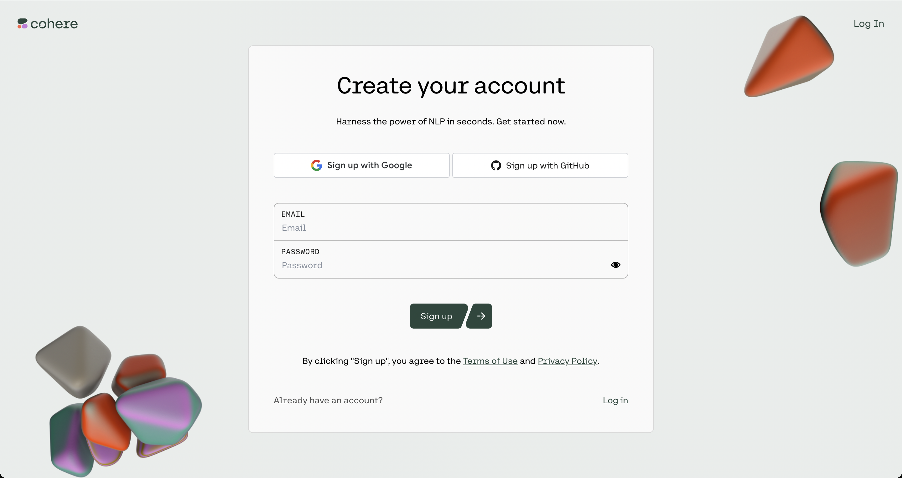

[](https://www.ardu-badge.com/Cohere_Client_Arduino)


# Cohere Client For Arduino

This library is to connect Cohere models to the Arduino environment. It is a work in progress, with the bare metal features currently, but should be sufficient for IoT and other types of integrations. 

This library requires users to have their own Cohere API key. Users must obtain an API Key from Cohere to use it.

## Authentication

The Cohere API uses API keys for authentication. Visit your API Keys page to retrieve the API key you'll use in your requests.

First, get your SECRET KEY issued here.
https://dashboard.cohere.ai/welcome/register


## Installation

### Using Arduino Library Manager

From Arduino IDE, go to menu *Sketch -> Include Library -> Manage Libraries...*
In Library Manager Window, search *"Cohere"* in the search form then select *"Cohere_Client"*
Click *"Install"* button.

### Manual installation

Download zip file from this repository by selecting the green *"Code"* dropdown at the top of repository, select *"Download ZIP"*
From Arduino IDE, select menu *Sketch -> Include Library -> Add .ZIP Library...*

Or use git:
 ```
 cd ~/arduino/libraries/
 gh repo clone ejri/Cohere_Client_Arduino
 ```

Then you should see the examples and be able to include the library in your projects with:

```
 #include <cohereclient.hpp>
```

## Usage

Example:
```
int max_tokens = 200;
String prompt = "Once upon a time in a magical land called";
String response = cohereClient.makeAPICall(max_tokens, prompt);
  String output = cohereClient.text_output(response);
  Serial.println(output);
  delay(5000);

  Serial.println("");

  String fullResponse = cohereClient.full_response(response);
  Serial.println(fullResponse);
  delay(5000);
```

Result
```
for the following prompt: Once upon a time in a magical land called
Generated output:
\nOnce upon a time in a magical land called Acme, there lived a young boy named Timmy. Timmy was an orphan and lived with his foster parents, Mr. and Mrs. Thompson. Timmy was a kind and gentle boy, and he loved his parents very much.\n\nOne day, while walking through the woods, Timmy stumbled upon a hidden cave. Intrigued, he explored the cave and discovered a secret treasure hidden deep within. Timmy was amazed at his discovery and quickly ran home to tell his parents about it.\n\nTimmy's parents were overjoyed at his discovery and thanked him for his hard work. They told him that the treasure would be his someday, and they began to plan how they would use it to make their lives better.\n\nOver time, Timmy grew up and had a family of his own. He never forgot about the treasure he had discovered as a child, and he always planned to use it to make his

Full Response:
HTTP/1.1 200 OK
content-type: application/json
num_chars: 896
vary: Origin
x-endpoint-monthly-call-limit: 5000
x-ratelimit-limit: 10000000
x-ratelimit-remaining: 9999998
x-ratelimit-reset: 1684403260
x-trial-endpoint-call-limit: 5
x-trial-endpoint-call-remaining: 4
date: Sun, 21 May 2023 00:08:58 GMT
content-length: 1071
Via: 1.1 google
Alt-Svc: h3=":443"; ma=2592000,h3-29=":443"; ma=2592000
Connection: close

{"id":"876cfa43-6b69-4b3a-8629-8c9c3214d818","generations":[{"id":"66809806-45b8-4322-b801-f70a65a2d842","text":"\nOnce upon a time in a magical land called Acme, there lived a young boy named Timmy. Timmy was an orphan and lived with his foster parents, Mr. and Mrs. Thompson. Timmy was a kind and gentle boy, and he loved his parents very much.\n\nOne day, while walking through the woods, Timmy stumbled upon a hidden cave. Intrigued, he explored the cave and discovered a secret treasure hidden deep within. Timmy was amazed at his discovery and quickly ran home to tell his parents about it.\n\nTimmy's parents were overjoyed at his discovery and thanked him for his hard work. They told him that the treasure would be his someday, and they began to plan how they would use it to make their lives better.\n\nOver time, Timmy grew up and had a family of his own. He never forgot about the treasure he had discovered as a child, and he always planned to use it to make his"}],"prompt":"Once upon a time in a magical land called","meta":{"api_version":{"version":"1"}}}

```

# Updates 
 - v0.1.0
    - Generation model support
    
# To do list 

- add support to other models

# License

 This software is written by Ibrahim El-chami and is licensed under The MIT License. Check License file for more information.    